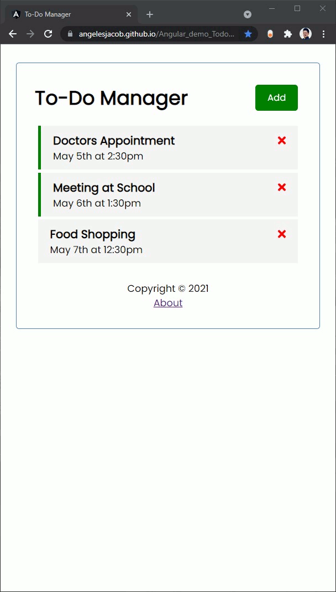

# Angular Demo: To Do Manager App

This is a simple <b>JavaScript app</b> that manages todo tasks online with easy-to-use user interface. <br />
It includes the <b>Angular ui</b> as well as <b>JSON-server</b> for our mock backend.


<br />

## Usage

### Run Angular server (http://localhost:4200)

```
ng serve
```

### Run the JSON server (http://localhost:5000)

```
npm run server
```
